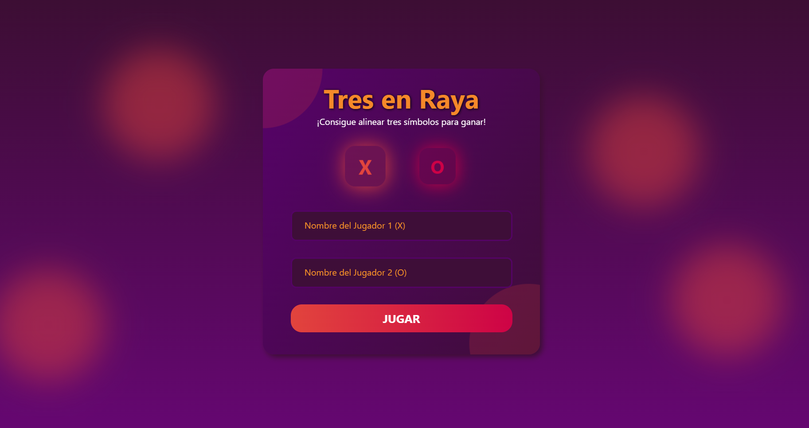
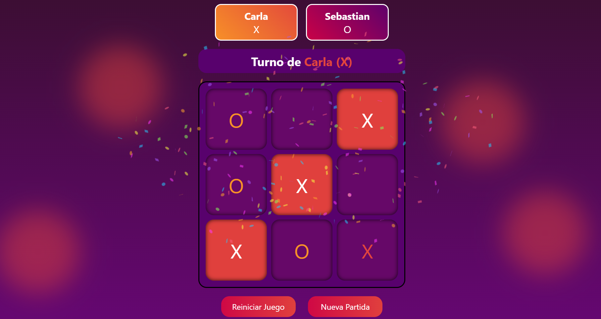
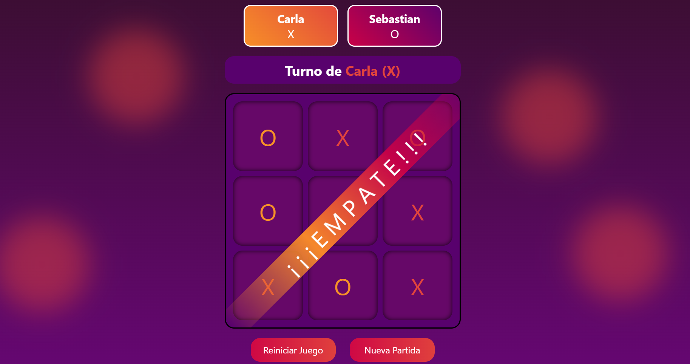

# 🎮 Juego de 3 en Raya (Tic-Tac-Toe)

Este es un simple pero funcional juego de 3 en raya desarrollado con **HTML**, **CSS** y **JavaScript puro (Vanilla JS)**. Dos jugadores pueden ingresar sus nombres y jugar desde el mismo dispositivo.

Cuenta con una **interfaz moderna y atractiva**, acompañada de **animaciones suaves** que mejoran la experiencia de juego.

## 🧠 Funcionalidades

- Ingreso de nombres para Jugador 1 y Jugador 2.
- Tablero interactivo.
- Detección automática de ganador o empate.
- Reinicio del juego sin recargar la página.

## 🛠️ Tecnologías Usadas

- HTML5
- CSS3
- JavaScript (Vanilla)

## 📷 Capturas

### Pantalla de inicio

### Juego en curso

### Fin del juego

## 🚀 ¿Qué sigue?

Estoy planeando mejorar el juego con nuevas funcionalidades como:

- 🤖 Modo de un jugador con IA (algoritmo Minimax o simple aleatorio).
- 🌐 Modo multijugador online para jugar desde distintos dispositivos.
- 📱 Diseño responsive para una mejor experiencia en móviles.

## 📄 Licencia

Este proyecto está bajo la licencia MIT. ¡Siéntete libre de usarlo, modificarlo o mejorarlo!
